# switch-model — multi-engine comparison

- **Generated:** 2026-06-05 18:44:44 UTC
- **Engines compared:** python, ngspice

- **Spectre status:** excluded from comparison (all runs fell back to Python — source Cadence env and see `spectre/*/logs/spectre_ron_sweep.log`)

Peer engines implement the same Ron equations (see `docs/MODEL.md`):

| Engine | Implementation |
| --- | --- |
| `python` | Python macromodel |
| `ngspice` | Behavioral SPICE (B-source, same equations) |
| `spectre` | Verilog-A `configurable_switch.va` |

## Per-engine summaries

- [python](python/REPORT.md)
- [ngspice](ngspice/REPORT.md)
- [spectre](spectre/REPORT.md)

## Metric spread

| Switch | Metric | Spread % | Tol % | OK |
| --- | --- | --- | --- | --- |
| `nmos` | `ron.ron_at_vcm_ohm` | 0.00 | 2.0 | yes |
| `nmos` | `ron.linearity_error_pct` | 0.00 | 2.0 | yes |
| `nmos` | `noise.flicker_corner_hz` | 0.00 | 2.0 | yes |
| `nmos` | `noise.noise_at_1hz_v_per_sqrt_hz` | 0.00 | 2.0 | yes |
| `pmos` | `ron.ron_at_vcm_ohm` | 0.00 | 2.0 | yes |
| `pmos` | `ron.linearity_error_pct` | 0.00 | 2.0 | yes |
| `pmos` | `noise.flicker_corner_hz` | 0.00 | 2.0 | yes |
| `pmos` | `noise.noise_at_1hz_v_per_sqrt_hz` | 0.00 | 2.0 | yes |
| `cmos` | `ron.ron_at_vcm_ohm` | 0.01 | 2.0 | yes |
| `cmos` | `ron.linearity_error_pct` | 0.03 | 2.0 | yes |
| `cmos` | `noise.flicker_corner_hz` | 0.00 | 2.0 | yes |
| `cmos` | `noise.noise_at_1hz_v_per_sqrt_hz` | 0.00 | 2.0 | yes |
| `nmos_dummy` | `ron.ron_at_vcm_ohm` | 0.00 | 2.0 | yes |
| `nmos_dummy` | `ron.linearity_error_pct` | 0.00 | 2.0 | yes |
| `nmos_dummy` | `noise.flicker_corner_hz` | 0.00 | 2.0 | yes |
| `nmos_dummy` | `noise.noise_at_1hz_v_per_sqrt_hz` | 0.00 | 2.0 | yes |
| `bs` | `ron.ron_at_vcm_ohm` | 0.00 | 2.0 | yes |
| `bs` | `ron.linearity_error_pct` | 0.00 | 2.0 | yes |
| `bs` | `noise.flicker_corner_hz` | 0.00 | 2.0 | yes |
| `bs` | `noise.noise_at_1hz_v_per_sqrt_hz` | 0.00 | 2.0 | yes |
| `bs_dummy` | `ron.ron_at_vcm_ohm` | 0.00 | 2.0 | yes |
| `bs_dummy` | `ron.linearity_error_pct` | 0.00 | 2.0 | yes |
| `bs_dummy` | `noise.flicker_corner_hz` | 0.00 | 2.0 | yes |
| `bs_dummy` | `noise.noise_at_1hz_v_per_sqrt_hz` | 0.00 | 2.0 | yes |

**Overall:** PASS

## Figure gallery

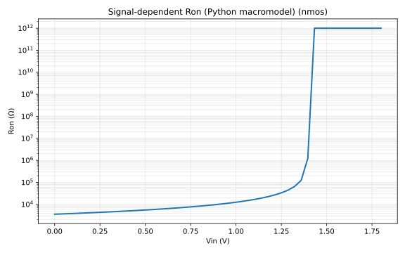

*python/nmos — Ron vs Vin*

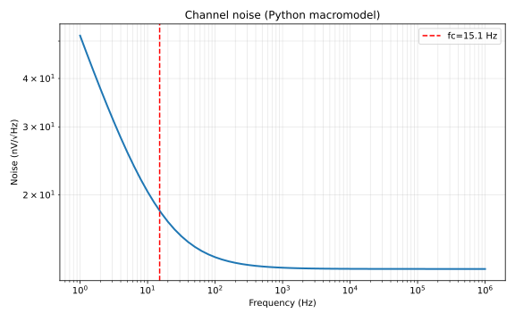

*python/nmos — noise spectrum*

*python/nmos — parasitics*

*ngspice/nmos — Ron vs Vin*

*ngspice/nmos — noise spectrum*

*ngspice/nmos — parasitics*

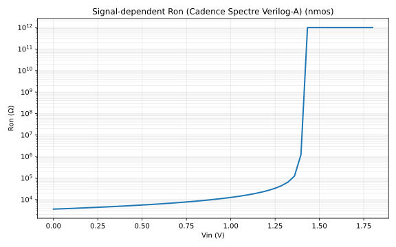

*spectre/nmos — Ron vs Vin*

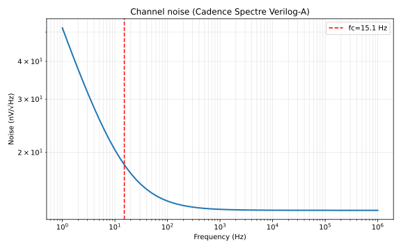

*spectre/nmos — noise spectrum*

*spectre/nmos — parasitics*

*python/pmos — Ron vs Vin*

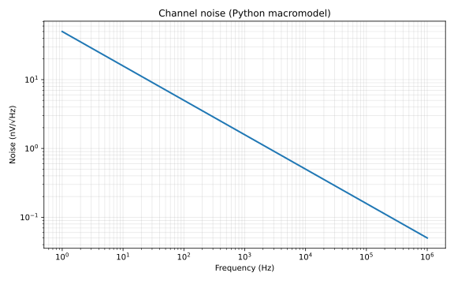

*python/pmos — noise spectrum*

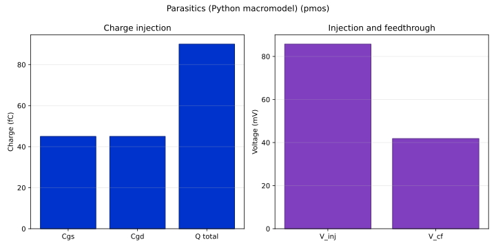

*python/pmos — parasitics*

*ngspice/pmos — Ron vs Vin*

*ngspice/pmos — noise spectrum*

*ngspice/pmos — parasitics*

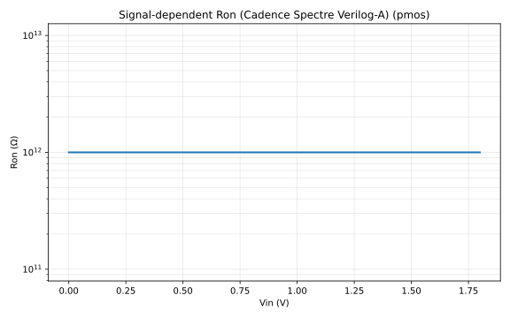

*spectre/pmos — Ron vs Vin*

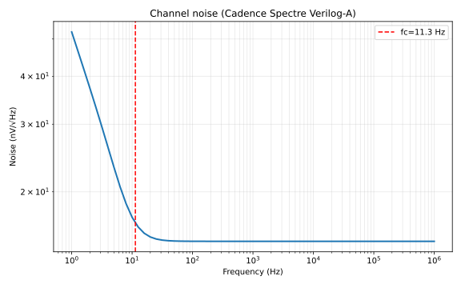

*spectre/pmos — noise spectrum*

*spectre/pmos — parasitics*

*python/cmos — Ron vs Vin*

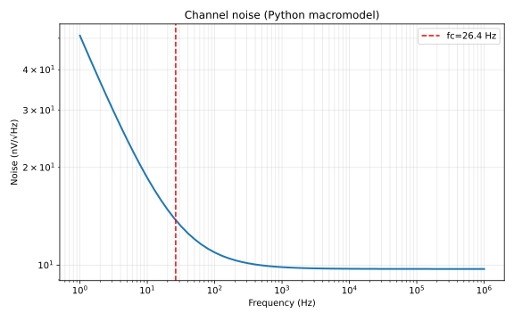

*python/cmos — noise spectrum*

*python/cmos — parasitics*

*ngspice/cmos — Ron vs Vin*

*ngspice/cmos — noise spectrum*

*ngspice/cmos — parasitics*

*spectre/cmos — Ron vs Vin*

*spectre/cmos — noise spectrum*

*spectre/cmos — parasitics*

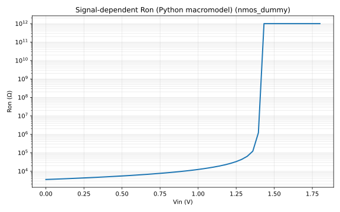

*python/nmos_dummy — Ron vs Vin*

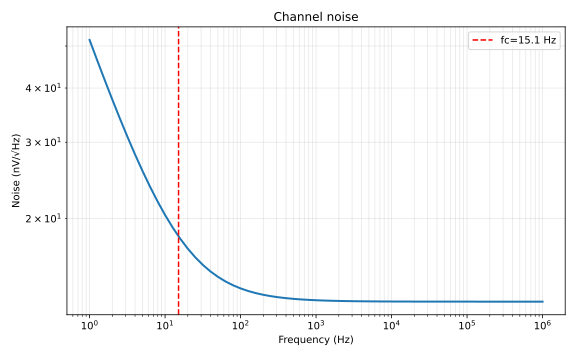

*python/nmos_dummy — noise spectrum*

*python/nmos_dummy — parasitics*

*ngspice/nmos_dummy — Ron vs Vin*

*ngspice/nmos_dummy — noise spectrum*

*ngspice/nmos_dummy — parasitics*

*spectre/nmos_dummy — Ron vs Vin*

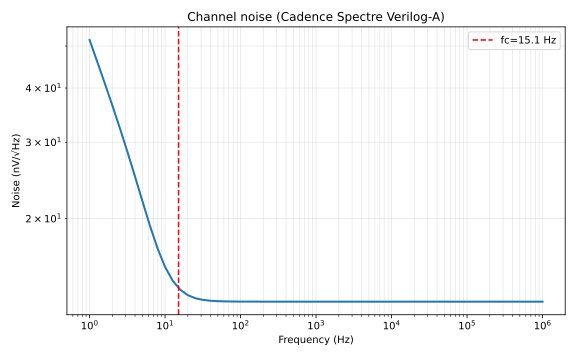

*spectre/nmos_dummy — noise spectrum*

*spectre/nmos_dummy — parasitics*

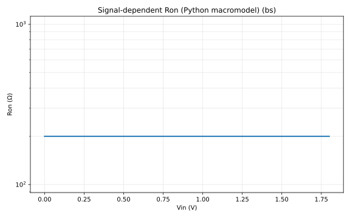

*python/bs — Ron vs Vin*

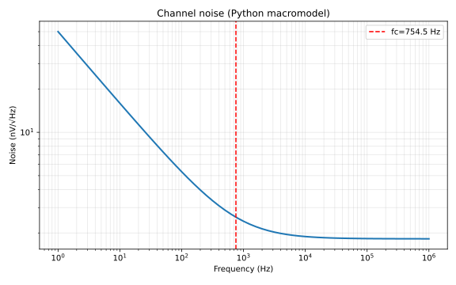

*python/bs — noise spectrum*

*python/bs — parasitics*

*ngspice/bs — Ron vs Vin*

*ngspice/bs — noise spectrum*

*ngspice/bs — parasitics*

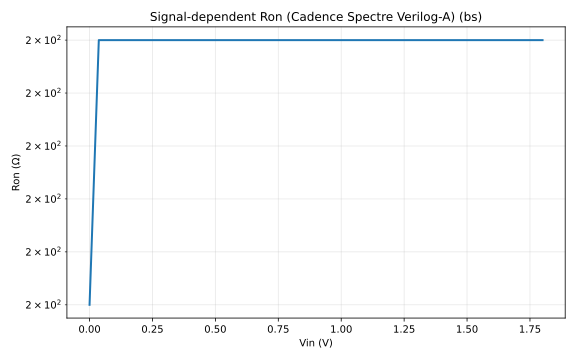

*spectre/bs — Ron vs Vin*

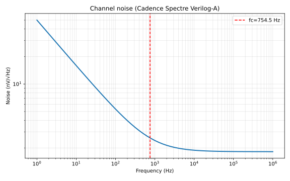

*spectre/bs — noise spectrum*

*spectre/bs — parasitics*

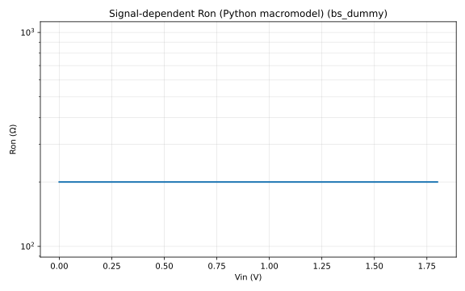

*python/bs_dummy — Ron vs Vin*

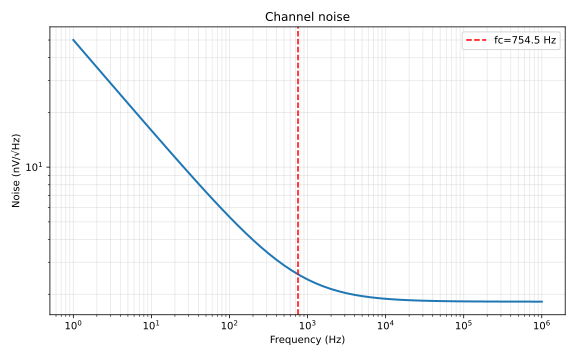

*python/bs_dummy — noise spectrum*

*python/bs_dummy — parasitics*

*ngspice/bs_dummy — Ron vs Vin*

*ngspice/bs_dummy — noise spectrum*

*ngspice/bs_dummy — parasitics*

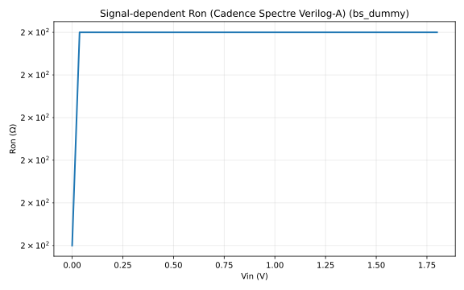

*spectre/bs_dummy — Ron vs Vin*

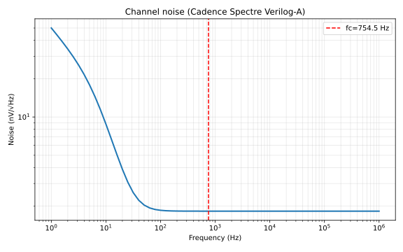

*spectre/bs_dummy — noise spectrum*

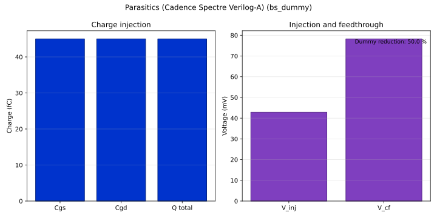

*spectre/bs_dummy — parasitics*

Regenerate: `python scripts/compare_engines.py --output-root outputs`
