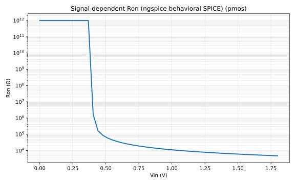
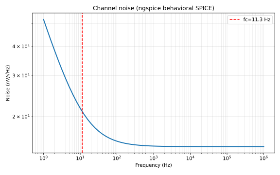
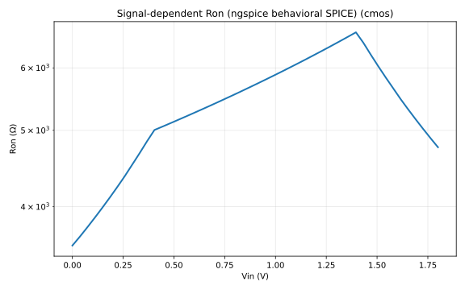
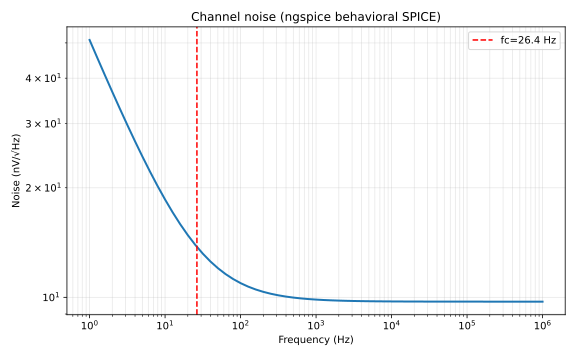
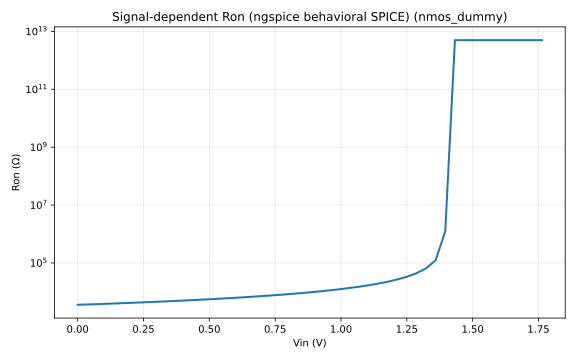
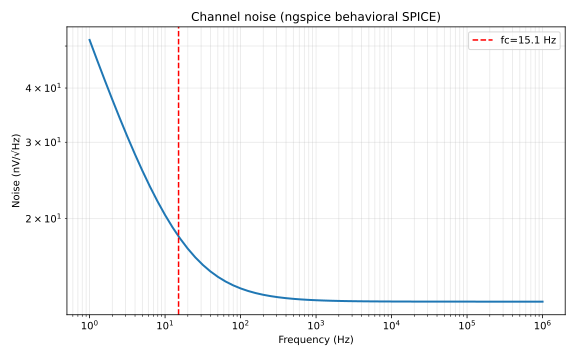
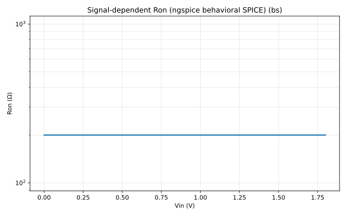
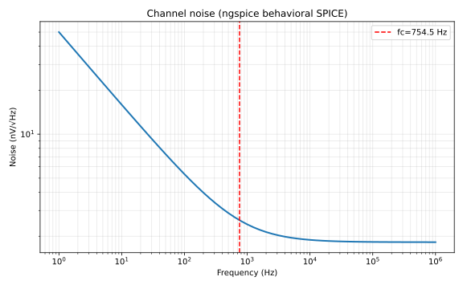
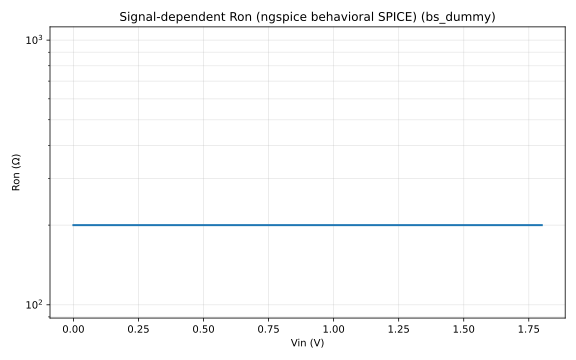

# switch-model — simulation summary

- **Generated:** 2026-06-05 14:04:29 UTC
- **Output root:** `ngspice/`

Reference: Zhou et al., *Flicker Noise Analysis on Chopper Amplifier*, IEEE NEWCAS 2021.

## Switch comparison

| Type | Label | Ron@Vcm (Ω) | Linearity err (%) | Flicker corner (Hz) | V_inj (mV) | V_cf (mV) |
| --- | --- | --- | --- | --- | --- | --- |
| `nmos` | NS | 9646 | 6.107e+05 | 15.09 | 85.71 | 41.86 |
| `pmos` | PMOS | 1.384e+04 | 8.143e+05 | 11.32 | 85.71 | 41.86 |
| `cmos` | TG | 5684 | 1543 | 26.41 | 85.71 | 41.86 |
| `nmos_dummy` | NS-D | 9646 | 6.107e+05 | 15.09 | 42.86 | 78.26 |
| `bs` | BS | 200 | 0 | 754.5 | 85.71 | 41.86 |
| `bs_dummy` | BS+D | 200 | 0 | 754.5 | 42.86 | 78.26 |

## Per-switch reports

- [nmos (NS)](nmos/REPORT.md)
- [pmos (PMOS)](pmos/REPORT.md)
- [cmos (TG)](cmos/REPORT.md)
- [nmos_dummy (NS-D)](nmos_dummy/REPORT.md)
- [bs (BS)](bs/REPORT.md)
- [bs_dummy (BS+D)](bs_dummy/REPORT.md)

## Figure gallery

*nmos — Ron vs Vin*

*nmos — noise*

*pmos — Ron vs Vin*

*pmos — noise*

*cmos — Ron vs Vin*

*cmos — noise*

*nmos_dummy — Ron vs Vin*

*nmos_dummy — noise*

*bs — Ron vs Vin*

*bs — noise*

*bs_dummy — Ron vs Vin*

*bs_dummy — noise*

## Artifacts

| Path | Description |
| --- | --- |
| `compare/switch_comparison.json` | Cross-type metrics |
| `<type>/ron_sweep.csv` | Ron sweep data |
| `<type>/noise_spectrum.csv` | Noise spectrum data |
| `<type>/switch_metrics.json` | Per-type metrics |
