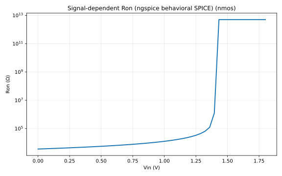
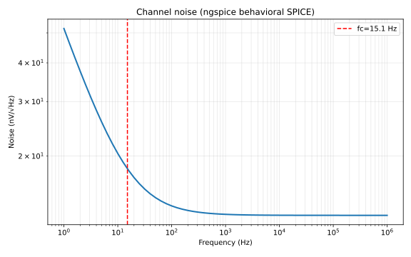
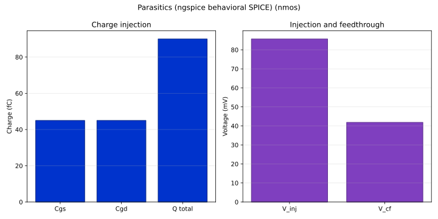

# nmos (NS)

- **Generated:** 2026-06-05 17:05:24 UTC

## Bench reports

- [Ron sweep](RON_REPORT.md)
- [Noise spectrum](NOISE_REPORT.md)
- [Parasitics](PARASITICS_REPORT.md)

## Figures

*Ron vs Vin*

*Channel noise spectrum*

*Parasitics summary*

## Metrics

| Metric | Value |
| --- | --- |
| Ron min | 3571 Ω |
| Ron max | 1.225e+06 Ω |
| Linearity error | 6.107e+05 % |
| Flicker corner | 15.09 Hz |
| V_inj | 0.08571 V |
| V_cf | 0.04186 V |
