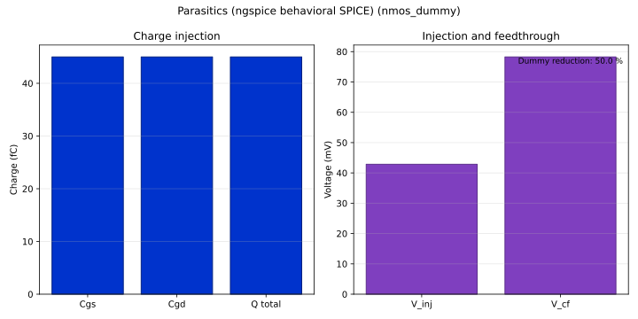

# Parasitics report — nmos_dummy

| Metric | Value |
| --- | --- |
| Charge injection Q | 4.500e-14 C |
| Injection step V_inj | 4.286e-02 V |
| Dummy reduction | 50.0 % |
| Clock feedthrough V_cf | 7.826e-02 V |
| Feedthrough attenuation | -27.2 dB |

