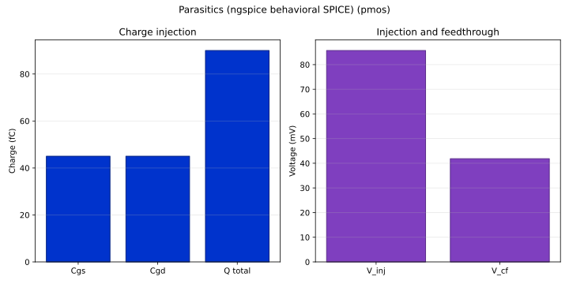

# Parasitics report — pmos

| Metric | Value |
| --- | --- |
| Charge injection Q | 9.000e-14 C |
| Injection step V_inj | 8.571e-02 V |
| Dummy reduction | 0.0 % |
| Clock feedthrough V_cf | 4.186e-02 V |
| Feedthrough attenuation | -32.7 dB |

